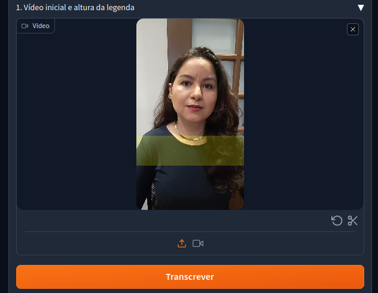
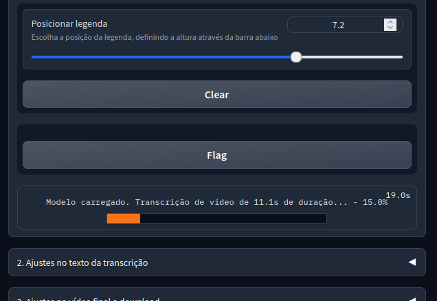
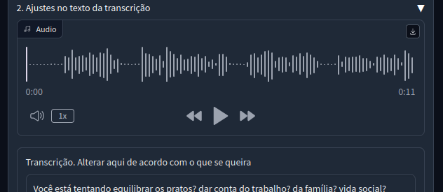
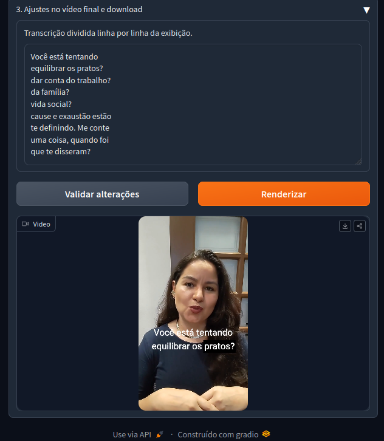

# App para criar legendas palavra a palavra
### Preparado para vídeos em formato retrato

### Como rodar:
Instale as dependências listadas abaixo, incluindo o modelo de sua preferência
```
python app.py
```

### Utiliza:
Interface:
* Gradio (https://github.com/gradio-app/gradio)

Speech-to-text:
* Whisper (OpenAI, https://github.com/openai/whisper)
* Stable_Whisper (https://github.com/jianfch/stable-ts)
* Usando este modelo (https://huggingface.co/jlondonobo/whisper-medium-pt)

Audio e Vídeo
* Moviepy (https://github.com/Zulko/moviepy)
* Pydub (https://github.com/jiaaro/pydub)


### O que ele faz:
- [x] Possui interface para carregar vídeo em formato retrato
- [x] Faz uma primeira transcrição do texto
- [x] Faz a normalização do áudio
- [x] Abre o texto transcrito + áudio para revisão 
- [x] Faz a quebra por linhas de acordo com a área de legenda
- [x] Permite forçar quebra de texto usando o caractere '|'
- [x] Busca manter próximos adjetivos de substantivos para melhorar a leitura
- [x] Permite escolher a posição da legenda no vídeo
- [x] Cria legenda no padrão 'destaque palavra a palavra', no tempo total equivalente a 2x do tempo do vídeo (em CPU)


### O que ele não faz:
- [ ] Criar arquivo requirements.txt
- [ ] Criar instalador

Ele confia muito em arquivos locais, e usa o nome "temp" pra tudo.
- [ ] Desacoplar ao máximo de arquivos locais
- [ ] Permitir customização de nome de arquivo
- [ ] Pegar nome com seleção aleatória
- [ ] Pegar nome com contexto dos primeiros segundos de áudio

Ele não oferece customização nenhuma de legenda
- [ ] Seletor para mudar tamanho, cor e tipo de fonte
- [ ] Seletor para mudar a quantidade de linhas

BUG: mesmo usando o stable-whisper, ainda assim algumas legendas ficam sem marcar a palavra
- [ ] Varrer o arquivo de timestamps para garantir que todas as palavras tenham um tempo alocado
- [ ] Forçar a quebra definida pelo usuário, mesmo que o whisper mude isso

Provavelmente não preciso usar o stable_whisper, e dá pra implementar o 'align' usando o whisper.
- [ ] Alterar o código para retirar a dependência do stable_whisper
- [ ] Testar outras implementações de speech-to-text mais rápidas
- [ ] Criar um seletor de modelo para testar outros modelos
- [ ] Testar com CUDA

Tratamento avançado de áudio.
- [ ] Habilitar redução de ruído
- [ ] Habilitar normalização trecho a trecho
- [ ] Habilitar supressão de som em período de silêncio
- [ ] Seletor de músicas de fundo


### Alguns prints:
1. Carregue o vídeo a receber legenda.


2. Enquanto a transcrição é feita, posicione a legenda.


3. Corrija distorções na legenda usando o editor e o áudio como guia.


4. Faça a revisão do texto final dividido e renderize o vídeo final.

Créditos para a modelo: @katiajacopeti IG